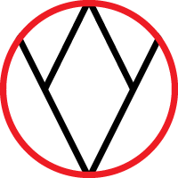
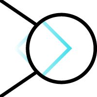
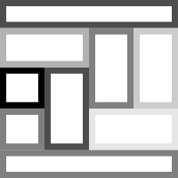

# Portfolio Uvod v Raziskovanje 1

Portfolio Žiga Šolar pri predmetu Uvod v Raziskovanje 1

## Kazalo
- [Vnos 1](#vnos-1)
  * [Predpostavka nevednosti](#predpostavka-nevednosti)
  * [Enakopraven dostop do znanja](#enakopraven-dostop-do-znanja)
  * [Vsebinsko razmišljanje](#vsebinsko-razmi-ljanje)
  * [Primarne in sekundarne kvalitete](#primarne-in-sekundarne-kvalitete)
- [Vnos 2](#vnos-2)
_________________
_________________
## Vnos 1 (2021-10-18)

### 1. Predpostavka nevednosti
_________________

Predpostavka nevednosti omogoča večji nivo radovednosti in hkrati večji potencial za raziskovanje. Predpostavka nevednosti nam hkrati tudi pripomore k innovativnem in ustvarjalnem razmišljanju. Kot Galileo omeni v knjigi _Gallileo: A very Short Introduction_ [[1](####-1)], je slepo sprejmanje informacij kot dejstev ravno nasprotno od predpostavke nevednosti in nam s tem poveča potrditveni bias:

> In Sarsi I seem to discern the firm belief that in philosophising one must support oneself on the opinion of some celebrated author, as if our minds ought to remain completely sterile and barren unless wedded to the reasoning of someone else.

### 2. Enakopraven dostop do znanja
_________________

Enakopraven dostop do znanja oziroma informacij je kot dvorezen meč, ki je na eni strani bolj oster kot na drugi. Enakopraven dostop do informacij je na prvi pogled odlična ideja in tudi samo dostop do informacij ni problematičen sam po sebi. Problematična je interpretacija informacij oziroma namerno izkrivljanje teh informacij [[4](####-4)]. Na drugi strani pa nam enakopraven dostop do znanja omogoča tudi večjo prostost pri raziskovanju. 

Citat Galilea o enakopravnem dostopu do znanja iz knjige:

> Philosophy is written in this grand book the universe, which stands continually open to our gaze. But the book cannot be understood unless one first learns to comprehend the language and to read the alphabet in which it is composed. 
>
> It is written in the language of mathematics, and its characters are triangles, circles, and other geometric figures, without which it is humanly impossible to understand a single word of it; without these, one wanders about in a dark labyrinth.

### 3. Vsebinsko razmišljanje
_________________

Vsebinsko razmišljanje nam kot znanstvenikom omogoča osredotočanje na vsebino oziroma podatke katere obravnavamo in zato izvzamemo velik del osebnega pristopa, ki zmanjša verjetnost konflikta na osebni ravni. 

Za obravnavanje podatkov je vsebinsko razmišljanje odlično orodje. Ko pa je v raziskavi vključen človek oziroma, ko neposredno raziskujemo obnašanje človeka, pa z vsebinskim razmišljanjem lahko spustimo pomembne podrobnosti pri raziskavi. (npr. Stanford Prison Experiment [[3](####-3)]) 

### 4. Primarne in sekundarne kvalitete
_________________

Znanstveni svet temelji na empiričnih podatkih in oprijemljivih pojavih/pojmih/stvareh; t.i. Primarnih kvalitetah. Primarne kvalitete nam omogočajo merljivosti naših znanstvenih poskusov in natančno določitev pojmov. 

Vendar pa so na drugi strani te plati pridemo do kvalitet, ki v ljudeh ustvarijo neke občutke. Občutke, ki se od posameznika do posameznika predvideno razlikujejo, vendar so predvideno pomembne za raziskovanja človeškega doživljanja. Vendar kot Galileo [[1](####-1)] opiše, brez ljudi tudi te kvalitete ne bi obstajale:

> I think that tastes, odours, colours, and so on are no more than mere names so far as the objects in which we locate them are concerned, and that they reside only in consciousness. If living creatures were removed, all these qualities would be wiped out and annihilated.

Osebno predpostavljam, da kvalitete, ki jih trenutno klasificiramo kot sekundarne so v bistvu primarne kvalitete za katere še nismo kot človeštvo ugotovili, kako jih empirično interpretirati, kar bo lahko mogoče nekoč v prihodnosti, ko bomo imeli boljše metode, tehnologijo in bolj razvito besedišče, kot tudi Thomas Nagel omeni v njegovem članku ___What Is It Like to Be a Bat?___ [[2](####-2)]: 

> We would have to develop such a phenomenology to describe the sonar experiences of bats; but it would also be possible to begin with humans. One might try, for example, to develop concepts that could be used to explain to a person blind from birth what it was like to see.

Hkrati pa če upoštevamo teorijo subjektivizma, moramo vse kvalitete klasificirati kot sekundarne.
_________________
_________________

## Vnos 2 (2021-10-25)

Vprašanja iz predavanj:

1. Ali je katastrofalno, da bi znanstveniki rekli "Mi zares ne vemo."?

V današnjem svetu menim, da bi tak odgovor v publiki povzročil velik nemir in upad zaupanja znanstvenikom. Stigma okrog znanstvenikov je zgrajena kot; oni vse vedo, oni se ne motijo. Sicer je ta problem rešljiv, vendar se mora kultura okoli znanstvenega sveta spremeniti.

2. Se z vsako teorijo približujemo končni resnici?

Po mojem mnenju ne, kajti menim, da končne resnice za res ni. Obstaja samo "naša" resnica, ki si jo ustvarjamo z našimi izumi. Menim, da obstaja neka splošna pot po kateri hodimo z iznajdbami v vedah kot so fizika, matematika in biologija; vendar interpretacija teh iznajdb nas vodi v smer katero si sami zadamo. 

Hkrati pa tudi menim, da v svetu, kjer se vesolje širi vsak trenutek v neskončnost, ne moramo za res imeti končne resnice oziroma vseh informacij.

_________________
### Problem	indukcije	v	znanosti

Indukcija je predpostavka neke resnice, ki izhaja iz nekih preteklih dogodkov. Kot primer; če 100x vržemo kovanec in pade na tla, lahko induktivno predpostavimo, da naslednjič ko vržemo kovanec bo padel na tla.

Njen problem je, da vedno predpostavljamo, da se bo dogodek, ki se je zgodil neštetokrat v preteklosti vedno ponovil v prihodnosti. Vedno predpostavljamo, da ko bomo vrgli kovanec bo padel na tla, vendar pa ne razmislimo o tem ali je možnost, da namesto upoštevanja Newtnovega zakona gravitacije [[7](####-7)] kovanec odleti v zrak. 

Problem, ki ga opisuje David Hume [[5](####-5)], da zaradi pretekle uniformnosti zakonov narave v prihodnosti ne mora biti spremembe teh zakonov.

Moje mnenje  o problemu indukcije  je podobno mnenju, ki ga je podal David Hume [[6](####-6)]. Indukcijsko razmišljanje je pogosto stvar navade in te predpostavke, da se stvari v prihodnosti ne bodo spreminjale so lahko marsikdaj nevarne (borza, ekonomija, geopolitika, globalno segrevanje, ipd.).

Vendar kot smo tudi omenili na predavanjih, boljše metod še ne poznamo!

**Razlaga abstraktne interpretacije tematike::**

Rdeč krog je asociacija na problem. Rdeča barva ponazarja nekaj nevarnega, krog pa ohranja naš fokus na notranji vsebini. Znotraj kroga črte predstavljajo mojo interpretacijo indukcije.

_________________
### Popperjeva	rešitev	problema	demarkacije

Problem demarkacije je, kako razlikovati med znanstvenim in neznanstvenim. Opisuje mejo med znanostjo ter drugimi človeškimi aktivnostmi.

Popper v knjigi "The Logic of Scientific Discovery" [[8](####-8)] jo opiše kot:
> The problem of finding a criterion which would enable us to distinguish between the empirical sciences on the one hand, and mathematics and logic as well as 'metaphysical' systems on the other, I call the problem of demarcation.

Popperjeva rešitev je opredeljena kot falsikabilnosti, ki postavi idejo, da za znanstveno izjavo je potrebno imeti tudi ravno nasproten ali kontradiktoren pogled. Primer; "Vsi labodi so beli" lahko kontramo kot "Ne, tu je črn labod".

Moje mnenje je, da sicer falsikabilnost zmanjša zaupanje generalne publike v znanstveno metodo, hkrati omogoča večji napredek na tistem področju, ker je pot katero se raziskovalci držijo zelo lepo opisana s to falikabilnostjo. Raziskovalci na tem področju točno vejo kakšne poskuse morajo izvajati, da potencialno ovržejo teorijo.

**Razlaga abstraktne interpretacije tematike:**

Črni črti in krog ponazarjata povečevalno steklo, ki nam omogoča razbrati štirikotnik oziroma "marker" in s tem razvozlati "demarkacijo".

_________________

### Osnovni	elementi	znanstvenega	opisa	izbrane	domene

Osnovni elementi znanstvenega okolja so teorija, hipoteza in zakon.

Moje mnenje, da so osnovni elementi zelo pomemben del znanstvenega opisa domene, kajti omogočajo nam bolj natančen opis našega problema, omogočajo sočasno dokumentacijo o problemu s katerim se soočamo in navedejo nam nek cilj. Osnovni elementi so tudi pomnembni za napredek v znanosti, kajti brez njih bi otežili vsem, ki bodo prišli za nami, kajti ne bodo imeli veliko virov za črpati znanje, ki smo ga mi nekoč pridobili.

**Razlaga abstraktne interpretacije tematike::**

Osnovni elementi so predstavljeni s škatlami različnih oblik "črno na belem".

_________________
_________________

## Vnos 3

## Literatura

#### [1]
Drake, Stillman (2001). Galileo a Very Short Introduction. OUP Oxford. pp. 83-85

#### [2] 
N. Thomas. What Is It Like to Be a Bat?, The Philosophical Review, vol. 83, no. 4, [Duke University Press, Philosophical Review], 1974, pp. 435–50, https://doi.org/10.2307/2183914.

#### [3] 
Zimbardo, P. G. (1972). The Stanford prison experiment

#### [4]
Choshen-Hillel, S., Shaw, A., & Caruso, E. M. (2020, January 30). Lying to Appear Honest. Journal of
Experimental Psychology: General. Advance online publication.
http://dx.doi.org/10.1037/xge0000737

#### [5]
Hume, David, 1739, A Treatise of Human Nature, Oxford: Oxford University Press.

#### [6]

Henderson, Leah, "The Problem of Induction", The Stanford Encyclopedia of Philosophy (Spring 2020 Edition), Edward N. Zalta (ed.), URL = <https://plato.stanford.edu/archives/spr2020/entries/induction-problem/>.

#### [7]

Voltaire, ., Letellier, ., Decroix, J. J. M., Condorcet, J.-A.-N. C., & Beaumarchais, P. A. C. (1820). Oeuvres complètes de Voltaire. A Paris: Chez Thomine et Fortic.

#### [8]
Popper, K. (2002). The Logic of Scientific Discovery (2nd ed.). Routledge. https://doi.org/10.4324/9780203994627